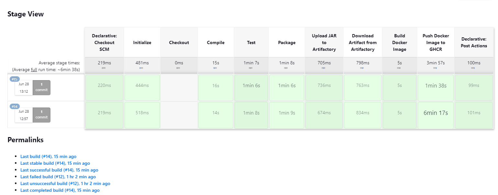

# JFrog Artifactory Demo

## Usage

If you don't need to build and just want to run the `spring-petclininc` application locally:

```sh
docker run --rm -p 8083:8080 -d ghcr.io/acrois/jfrog-artifactory-demo
```

Give the application a few moments to initialize and then visit the application at http://localhost:8083

## Build

The build uses [Jenkins](https://www.jenkins.io/) to build the [spring-petclinic](https://github.com/spring-projects/spring-petclinic/) application, incorporating [JFrog Artifactory](https://jfrog.com/artifactory/) to store the Java Archive (JAR), and finally publishes the image to GitHub (ghcr.io).

### Requirements

- Git
- Docker
- Docker Compose

### Setup

```bash
./setup.sh
```

### High-level Overview

1. Configure Artifactory
   - Create Repository
   - Create Project
   - Create User
2. Configure Jenkins
   - Artifactory Credentials
   - GitHub Credentials
   - Create Pipeline
3. Run Jenkins Pipeline (using [Jenkinsfile](./Jenkinsfile))
   - Checkout repository (local or remote Git repo)
   - Compile
   - Test
   - Package
   - Upload to Artifactory
   - Download from Artifactory
   - Package into Docker image (using [Dockerfile](./Dockerfile))
   - Upload to ghcr.io

Note: this repository is configured to source dependencies from JCenter (using [settings.xml](./settings.xml)) although it has [been sunsetted](https://jfrog.com/blog/into-the-sunset-bintray-jcenter-gocenter-and-chartcenter/) is read-only. This simulates a legacy application configuration.

### Local Development Configuration

You will need to follow this configuration if you intend on testing this on your local machine. I attempted to make it possible to run the [Jenkinsfile](./Jenkinsfile) in both local development and remote contexts, but further tweaks may be necessary to your configuration in order to properly address the artifactory server and GitHub login.

1. Log into JFrog Artifactory: http://localhost:8082 with the default `admin` and `password`. You will be required to change this the first time you log in.
2. Create an Artifactory repository: "petclinic-mvn" as the name, "maven-2" as the project type, DEV environment.
3. Create an Artifactory project: "petclinic" as the name, with "pk" as the key. Associate it with the repository created in the previous step.
4. Create an Artifactory user for Jenkins to use. For testing, I gave it admin rights, but in a production context, you'd want to narrow the scope of access to just the resources you are trying to give Jenkins access to.
5. Log into Jenkins: http://localhost:8080 with `admin` as both the username and password. This should have been set up during Jenkins initialization from the Groovy [init.groovy.d](./jenkins/init.groovy.d/) scripts where the required plugins (including artifactory) should have been installed.
6. Configure Artifactory: Go to "Manage Jenkins", under Artifactory specify the JFrog instance ID as "artifactory", the endpoint is `http://artifactory:8081`, and enable the credential provider. Add the credentials you set up in step #4 and test the connection to ensure that everything is configured properly.
7. Create a pipeline in Jenkins: Use SCM (git) and point it to `/var/jenkins_home/petclinic-demo` (or `https://github.com/acrois/jfrog-artifactory-demo.git` if building remotely)
8. Optionally, add a credential in Jenkins named "github-token" and change the PUSH_TO_GHCR to "true" if you are ready to push to ghcr.io.
9. Run the build!

Successful Jenkins Pipeline:
